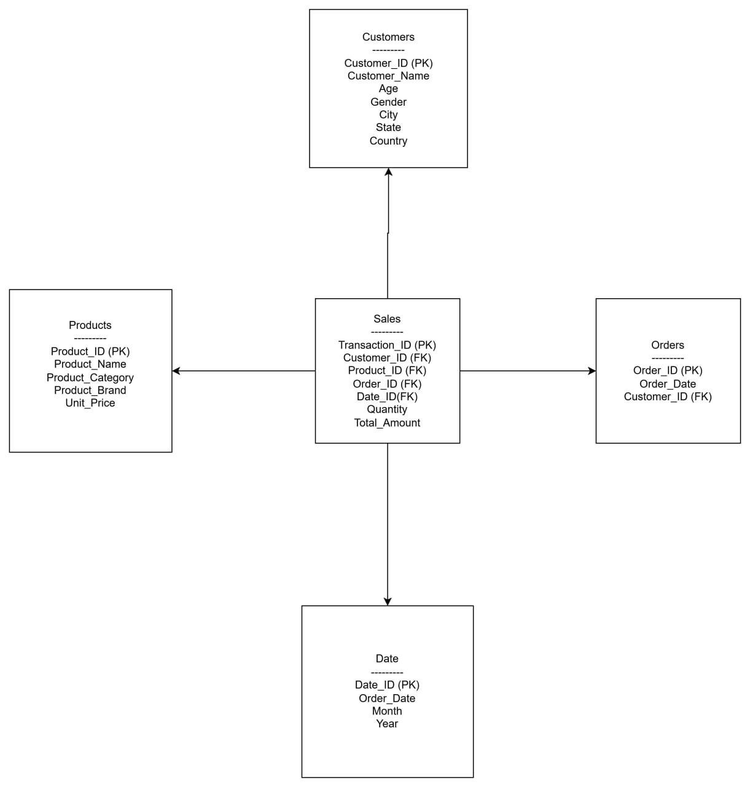

# Retail Analytics RFM Analysis

## Project Overview
This project focuses on performing Retail Analytics using RFM (Recency, Frequency, Monetary) analysis. The goal is to segment customers based on their purchasing behavior.

## Objectives
- Perform data cleaning
- Build star schema
- Conduct RFM analysis
- Create customer segments
- Build dashboard for insights

## Dataset Information
The dataset includes customer transactions, product details, and order information.

## Data Model (ERD)

## Tools Used
- SQL
- Python
- GitHub
- Power BI (for dashboard)

## Project Structure
- Data
- SQL
- Python
- Documentation
- Dashboard

## Outcome
Customer segmentation based on RFM analysis and insights through dashboard visualization.
